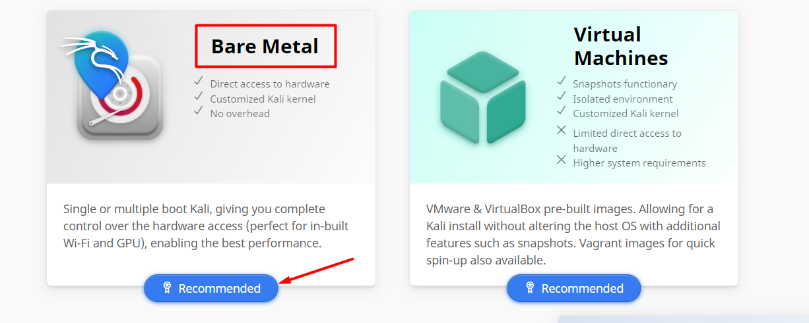
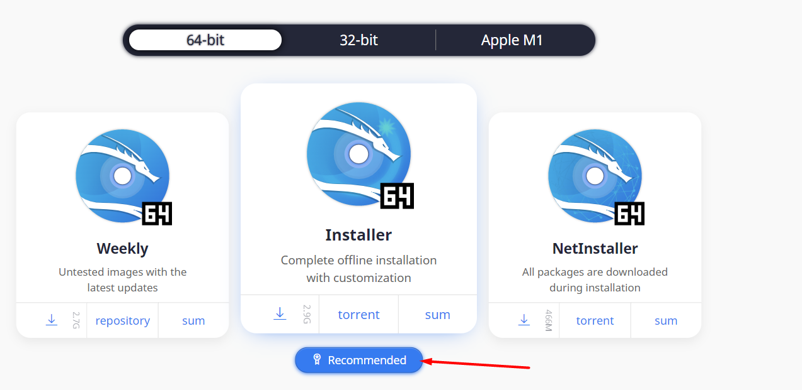
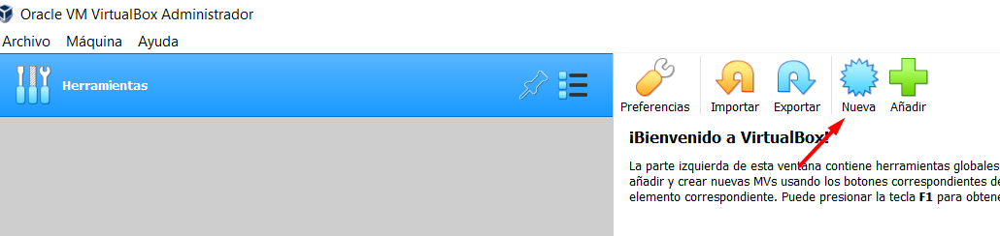
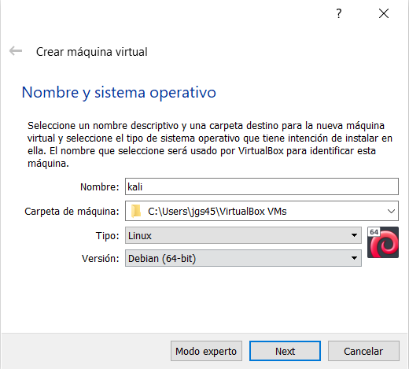
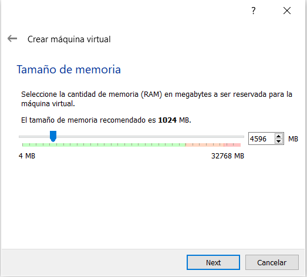
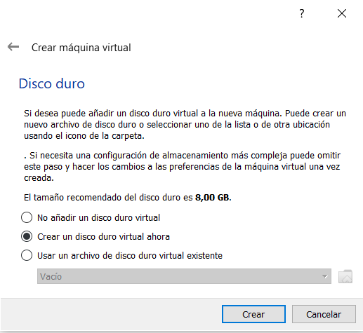
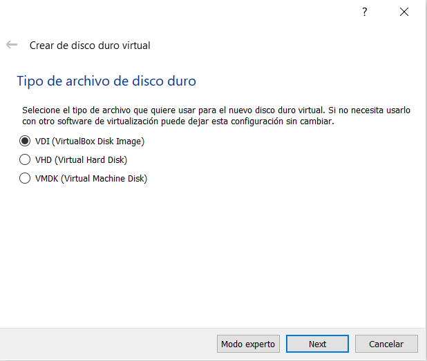
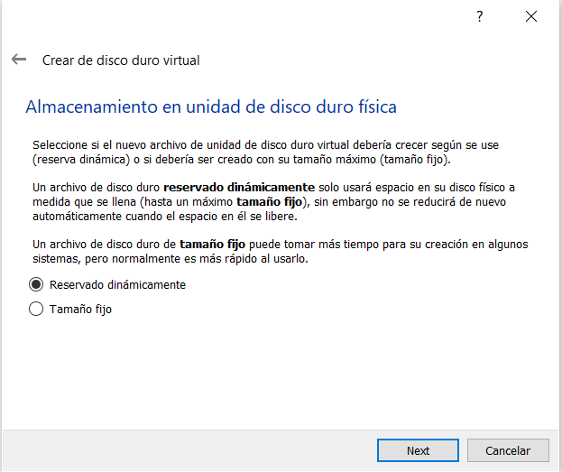
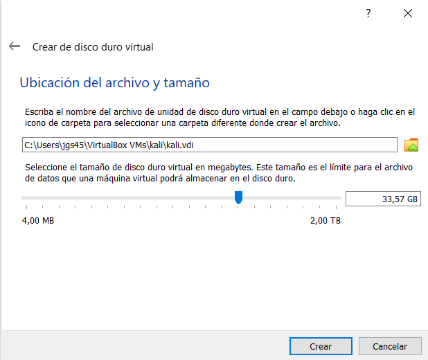

## Instalación de Virtual Box

El primer paso para crear nuestro laboratorio es descargarnos [Virtual Box](https://www.virtualbox.org/wiki/Downloads), un software de virtualización para crear máquinas virtuales
con instalaciones de sistemas operativos. Esto quiere decir que si tienes un ordenador con Windows, por ejemplo, puedes crear una máquina virtual con cualquier otro sistema operativo
sin necesidad de crear particiones en tu propio equipo. Una vez descargado, ejecuta el archivo e instálalo.

## Descarga imagen Kali

Desde la página oficial de [Kali-Linux](https://www.kali.org/get-kali/#kali-bare-metal) descarga el instalador de kali eligiendo la opción Bare Metal.

## Instalación de Kali

Una vez instalado Virtual Box y descargada la imagen de Kali, vamos a instalar Kali en nuestro equipo.
Ejecuta el software de virtualización Virtual Box y elige la pestaña <strong><i>Nueva</i></strong>.

A continuación pon nombre a tu máquina virtual, escribe Linux en la opción tipo, y elige la versión de Debian (64-bit).

Elige la cantidad de memoria RAM reservada para la máquina virtual según las características de tu equipo anfitrión.

Deja las siguientes opciones por defecto.

A continuación asigna el espacio del disco duro virtual que tendrá la máquina. 

