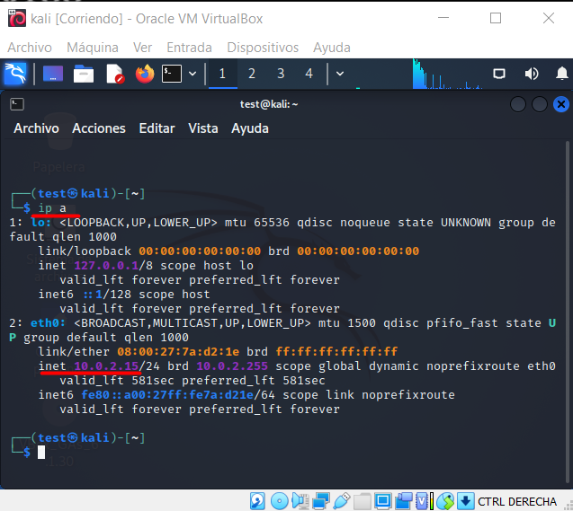
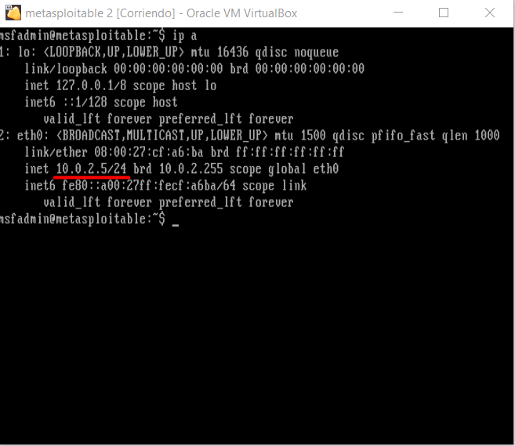
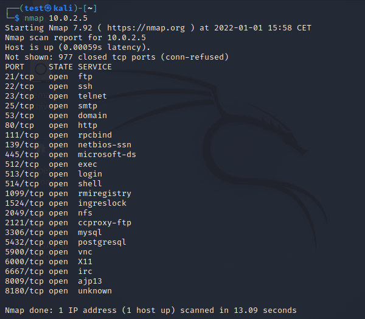
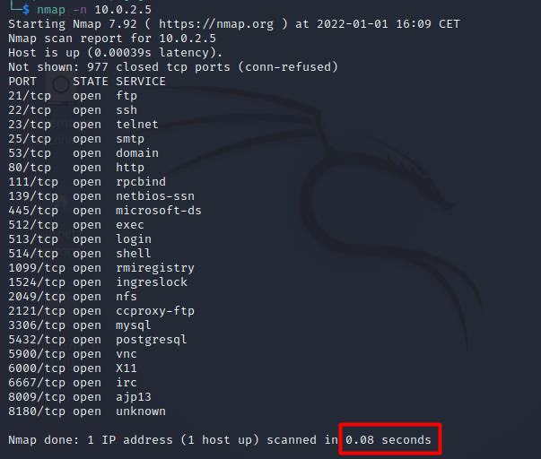
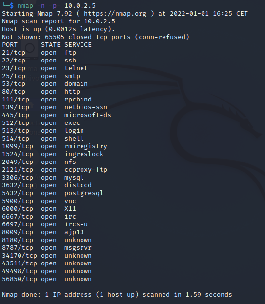
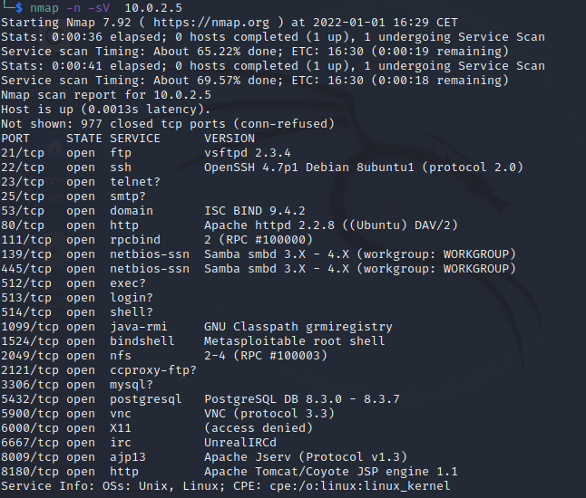

## ¿ Qué es Nmap ?

Namp (Network Mapper) es una herramienta gratuita y multiplataforma para mapear redes en busca hosts activos, puertos abiertos y servicios corriendo.
Nmap viene instalado por defecto en Kali Linux.

## Port Scanner

Como hemos mencionado, con Nmap podemos ver que puertos están abiertos en un determinado host, y ver que servicios se están ejecutando.
Existen un total de 65536 puertos, que van desde el 0 al 65535. Los puertos que van desde el 0 al 1023 son los puertos bien conocidos (en inglés, well-known port).
Existe un estándar de asignación de puertos, que los divide en tres grupos:

- 0 - 1023. Están reservados para el sisteman operativo y los protocolos más importantes. Por ejemplo 21 FTP, 22 SSH, 80 HTTP.	
- 1024 - 49151. Son los puertos registrados, los que se utilizan por las aplicaciones que se instalan en el ordenador.
- 49152 - 65535. Son los puertos dinámicos o privados, los que corresponden a las aplicaciones que necesitan conectarse a un servidor.

## Ejemplos prácticos con Nmap

Nmap puede identificar los dispositivos en una red, detectar el sistema opertativo de un host, y determinar que servicios se están ejecutando. Aquí vamos a centrarnos en descubrir qué
puertos y servicios se están ejecutando en la máquina vulnerable Metasploitable2. Si aún no has creado el laboratorio de pruebas, te dejo este [enlace](../laboratorio) para crearlo paso a paso.

Ejecuta el comando `ip a` o `ifconfig` desde la terminal en cada una de las máquinas para ver la dirección IP asignada.

Ahora tenemos las IPs de nuestras máquinas, en mi caso la 10.0.2.15 para Kali y la 10.0.2.5 para Metasploitable2.

El escaneo más básico para el reconocimiento de puertos con nmap es el comando `nmap ip_objetivo`.

Podemos observar en la parte inferior derecha el tiempo que tomó nmap para el escaneo de puertos: 13.09s. Ahora bien, con el parámetro `-n` de nmap podemos reducir el tiempo de scaneo. Este parámetro hace
que nmap no realice resolución DNS lo que reduce bastante el tiempo.

De forma predeterminada nmap solo escanea los 1000 puertos más comunes para cada protocolo. Con el parámetro `-p` podemos indicar qué puertos queremos escanear separados por coma. Para indicar que queremos escanear todos los puertos
podemor ejecutar `nmap -n -p- ip_objetivo`.

Para ver las versiones de los servicios que se están ejecutando usamos el parámetro `-sV`

Ahora Nmap muestra otra columna "VERSION", con información de las versiones de los servicios. Esta información es muy valiosa para ver versiones vulnerables de los servicos que se ejecutan.

Podemos guardar los resultados del scaneo para tenerlos siempre a mano y no tener que volver a ejecutar nmap sobre el host objetivo. Nmap puede guardar la salida del comando en varios formatos,
seguido del nombre del archivo de salida.

- Salida normal (-oN).
- Salida XML (-oX).
- Salida grepeable (-oG).
- Salida en todos los formatos (-oA).

