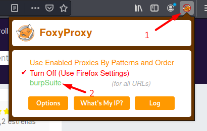
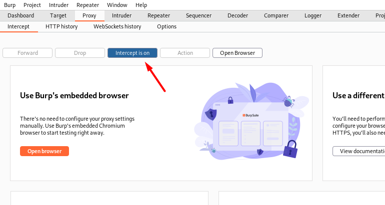

## ¿ Qué es Burp Suite ?

Burp Suite es considerada la navaja suiza del pentester. Es una herramienta utilizada en auditorías de seguridad de aplicaciones Web. Un proxy de interceptación
para el análisis y edición del tráfico Web. Con Burp Suite se pueden interceptar las peticiones y respuestas, leerlas y editarlas en tiempo real antes de que lleguen
a su destino final.

Burp Suite se encuentra desarrollado y soportado por la empresa PortSwigger LTD. Existe una versión gratuita (Community Edition) y una de pago (Professional Edition).
Kali Linux trae por defecto la versión gratuita de Burp Suite. Si aún no tienes instalado Kali puedes seguir los pasos de instalación en este [enlace](../laboratorio).

## Configuración inicial Burp Suite

Puedes abrir Burp desde la terminal con el comando `burpsuite`. Una vez iniciado asegúrate de que el proxy esté escuchando en el puerto <strong>8080</strong>.

Te recomiendo que instales la extensión [FoxyProxy](https://addons.mozilla.org/es/firefox/addon/foxyproxy-standard/) para Firefox. Esta extensión te permite configurar el proxy del navegador de una forma más rápida.

Una vez instalada, abre la extensión y sigue estos pasos para configurar el proxy de tal forma que las peticiones pasen por Burp Suite.

Ahora puedes activar o desactivar el proxy Burp Suite desde la extensión cuando quieras.

Otro paso importante es instalar en el navegador el certificado de Burp Suite (Firefox). Para ello escribe la siguiente direccion en el navegador [http://burpsuite/](http://burpsuite/) con el proxy activado.

Descarga el certificado y sigue los siguientes pasos:

En ajustes del navegador, busca los certificados instalados.

Elige la opción importar y selecciona el fichero con extensión .der descargado.

Marca las dos casillas de la ventana emergente y pulsa ok.

¡Bien hecho!. Ya tienes configurado Burp Suite para dar los primeros pasos, vamos a ello.

Cada vez que inicies Burp Suite, el Intercept del proxy está en ON, esto significa que si quieres navegar por la página web tendrás que hacer click en Forward para que la petición llegue a su destino
y continuar la navegación. Puedes desactivar el Intercept y navegar por la Web y activarlo cuando quieras ver o editar la petición.

Otra opción interesante es la pestaña HTTP history de proxy, la cual muestra el historial de las peticiones.

Es recomendable asignar el Scope en la pestaña Target de Burp Suite.

Esto evitará a que se muestre en el historial las peticiones que no estén dentro del Scope a analizar.

Cuando le des a aceptar se mostrará una ventana emergente. Dale a YES para que Burp no registre otras URLs distintas al objetivo en el historial.

Hasta aquí una primera visión de Burp Suite. En próximos artículos iremos viendo que opciones nos trae esta herramienta imprescindible para auditorías Web.

Hasta la próxima.

