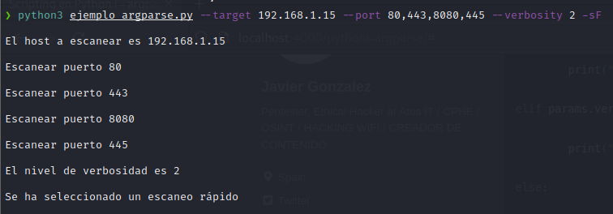

## Python3 - argparse

Este post pretende ser una introducción al módulo <strong>argparse</strong> de Python. El módulo argparse viene por defecto cuando se instala Python e incluye herramientas para
construir procesadores de argumentos y opciones de línea de comando.

Para poder usar argparse lo primero que hay que hacer es importar el módulo: ```import argparse```. Ahora podemos trabajar con este módulo, y lo primero que vamos a hacer es
crear un objeto:

```bash

#!/usr/bin/python3

import argparse

parser = argparse.ArgumentParser()

```

ArgumentParser admite varios argumentos en formato clave:valor; algunos de ellos son:
- <strong>description</strong>, texto que se mostrará antes de la ayuda del argumento.
- <strong>epilog</strong>, texto que se mostrará después de la ayuda del argumento.

Pongamos algunos ejemplos.

Supongamos que queremos hacer una breve descripción de la función que realiza nuestro script (argumento con clave description), y mostrar al final de la ayuda un ejemplo de uso (argumento con clave epilog).

```bash
#!/usr/bin/python3

import argparse

parser = argparse.ArgumentParser(description="Escaner de puertos",epilog="Ejemplo de uso: python3 ejemplo_argparse.py --target 127.0.0.1")

```
Ahora ejecutamos nuestro script: ```python3 ejemplo_argparse.py```


Por defecto, ArgumentParser agrega una opción que simplemente muestra el mensaje de ayuda, -h y --help.

Otra forma más interesante de usar el argumento epilog de ArgumentParser es asignándole el valor de una variable creada previamente. Imaginemos que queremos mostrar varios ejemplos
de uso de nuestra herramienta. Para ello declaramos una variable llamada epilogo y le asignamos el texto que queremos que se muestre al final de la ayuda.

```bash
#!/usr/bin/python3

import argparse

epilogo = '''Ejemplo de uso de la herramienta

	+ Visualizar la ayuda:

		python3 ejemplo_argparse.py --help

	+ Escano básico:

		python3 ejemplo_argparse.py --target 127.0.0.1

	+ Escanear varios puertos:

		python3 ejemplo_argparse.py -target 127.0.0.1 -p 80,443,8080'''

parser = argparse.ArgumentParser(description="Escaner de puertos",epilog=epilogo,formatter_class=argparse.RawDescriptionHelpFormatter)
```

Analicemos el códgio:

Hemos declarado la variable <strong>epilogo</strong> después de importar el módulo, y le hemos asignado el texto que queremos asignar al argumento con clave epilog de ArgumentParser.

Para formatear la salida y tener más control sobre cómo se muestran las descripciones textuales usamos el argumento ```formatter_class=argparser.RawDescriptionHelpFormatter```, de lo contrario
se mostraría todo en una línea.


Otros argumentos que permite ArgumentParser son:
- <strong>prog</strong>, determina el nombre del programa.
- <strong>usage</strong>, texto que describe como se usa el programa.
- <strong>add_help</strong>, agregar la opción -h / --help al analizador (por defecto es True).

### Agregando argumentos

Para añadir argumentos a nuestro script usamos el método <strong>add_argument()</strong>.

Existen dos tipos de argumentos:<strong> posicionales</strong> y <strong>opcionales</strong>.

Si declaramos un argumento posicional, es obligatorio usarlo cuando ejecutamos nuestro script.

```bash

#!/usr/bin/python3

import argparse

epilogo = '''Ejemplo de uso de la herramienta

	+ Visualizar la ayuda:

		python3 ejemplo_argparse.py --help

	+ Escano básico:

		python3 ejemplo_argparse.py --target 127.0.0.1

	+ Escanear varios puertos:

		python3 ejemplo_argparse.py --target 127.0.0.1 -p 80,443,8080

'''

parser = argparse.ArgumentParser(description="Escaner de puertos",epilog=epilogo,formatter_class=argparse.RawDescriptionHelpFormatter)

parser.add_argument("target")

params = parser.parse_args()

print(params.target)

```


Nos lanza un error porque no establecimos el argumento target. Ahora ejecutamos el script pasándole un objetivo.


Como se aprecia en la imagen el script se ejecutó sin errores y mostró el objetivo.

Los argumentos opcionales son aquellos que se declaran precedidos de la flag - o --. Como su propio nombre indica, son opcionales a la hora de ejecutar el script.

```bash
#!/usr/bin/python3

import argparse

epilogo = '''Ejemplo de uso de la herramienta

	+ Visualizar la ayuda:

		python3 ejemplo_argparse.py --help

	+ Escano básico:

		python3 ejemplo_argparse.py --target 127.0.0.1

	+ Escanear varios puertos:

		python3 ejemplo_argparse.py --target 127.0.0.1 -p 80,443,8080

'''

parser = argparse.ArgumentParser(description="Escaner de puertos",epilog=epilogo,formatter_class=argparse.RawDescriptionHelpFormatter)

parser.add_argument("-t")

params = parser.parse_args()

print(params.t)
```
Si ejecutamos el script sin usar el argumento -t, el script no lanzará ningún error, ya que este argumento es opcional.


También podemos especificar el argumento usando las flags - y -- al mismo tiempo. En este caso, para imprimir el valor del argumento, usaremos el nombre de la flag --, ya sea usando - o -- cuando ejecutemos el script.
Vamos a verlo.

```bash
#!/usr/bin/python3

import argparse

epilogo = '''Ejemplo de uso de la herramienta

	+ Visualizar la ayuda:

		python3 ejemplo_argparse.py --help

	+ Escano básico:

		python3 ejemplo_argparse.py --target 127.0.0.1

	+ Escanear varios puertos:

		python3 ejemplo_argparse.py --target 127.0.0.1 -p 80,443,8080

'''

parser = argparse.ArgumentParser(description="Escaner de puertos",epilog=epilogo,formatter_class=argparse.RawDescriptionHelpFormatter)

parser.add_argument("-t","--target")

params = parser.parse_args()

print(params.target)

```

Aquí vemos que podemos llamar al argumento con la versión corta -t o la versión larga --target. En la función print() usamos params.target independientemente de como ejecutemos el script.


Al igual que ArgumentParser(), add_argument() también admite unos atributos mediante clave:valor para trabajar con los argumentos. Algunos de ellos son:
- <strong>action</strong>, la acción que se realizará cuando se encuentre este argumento en la línea de comandos. Las acciones que puede tomar el argumento son:

  - <strong>store</strong>, es la opción por defecto, almacena el valor del argumento.
  - <strong>store_const</strong>, almacena el valor de la palabra clave const.
  - <strong>store_true y store_false</strong>, para almacenar los valores de True y False respectivamente.
  - <strong>append</strong>, almacena una lista y agrega cada valor del argumento a la lista. El siguiene script muestra por pantalla los  puertos
agregados a una lista mediante ```action="append"```.

```bash

#!/usr/bin/python3

import argparse

epilogo = '''Ejemplo de uso de la herramienta

	+ Visualizar la ayuda:

		python3 ejemplo_argparse.py --help

	+ Escano básico:

		python3 ejemplo_argparse.py --target 127.0.0.1

	+ Escanear varios puertos:

		python3 ejemplo_argparse.py --target 127.0.0.1 -p 80,443,8080

'''

parser = argparse.ArgumentParser(description="Escaner de puertos",epilog=epilogo,formatter_class=argparse.RawDescriptionHelpFormatter)

parser.add_argument("-p","--ports",action="append")

params = parser.parse_args()

for port in params.ports:

	print(port)
   parser = argparse.ArgumentParser(description="Escaner de puertos",epilog=epilogo,formatter_class=argparse.RawDescriptionHelpFormatter)

   parser.add_argument("-p","--ports",action="append")

   params = parser.parse_args()

   for port in params.ports:

	print(port)
 ```
Al llamar varias veces al argumento -p o --ports se crea una lista de puertos que se muestran por consola.


  - <strong>count</strong>, cuenta el número de veces que ocurre un argumento

En el siguiente script podemos ver un ejemplo de ```action="count"```, que muestra por pantalla el nivel de verbosidad elegido.

```bash
#!/usr/bin/python3

import argparse

epilogo = '''Ejemplo de uso de la herramienta

	+ Visualizar la ayuda:

		python3 ejemplo_argparse.py --help

	+ Escano básico:

		python3 ejemplo_argparse.py --target 127.0.0.1

	+ Escanear varios puertos:

		python3 ejemplo_argparse.py --target 127.0.0.1 -p 80,443,8080

'''

parser = argparse.ArgumentParser(description="Escaner de puertos",epilog=epilogo,formatter_class=argparse.RawDescriptionHelpFormatter)

parser.add_argument("-v","--verbosity",action="count")

params = parser.parse_args()

print(params.verbosity)
```


- <strong>nargs</strong>, número de argumentos que deben de aparecer en la línea de comandos. Estos argumentos se agregan a una lista.

  - nargs="?", indica que el argumento puede tener cero o un valor.
  - nargs="*", indica que el argumento puede tener cero o más valores.
  - nargs="+", indica que el argumento debe tener al menos un valor.
  - nargs=N, indica el número de valores que ha de tener el argumento, donde N es un número entero.

Veamos algunos ejemplos:

<strong>Script con nargs="?"</strong>

```bash
#!/usr/bin/python3

import argparse

epilogo = '''Ejemplo de uso de la herramienta

	+ Visualizar la ayuda:

		python3 ejemplo_argparse.py --help

	+ Escano básico:

		python3 ejemplo_argparse.py --target 127.0.0.1

	+ Escanear varios puertos:

		python3 ejemplo_argparse.py --target 127.0.0.1 -p 80,443,8080

'''

parser = argparse.ArgumentParser(description="Escaner de puertos",epilog=epilogo,formatter_class=argparse.RawDescriptionHelpFormatter)

parser.add_argument("--target",nargs="?", default="127.0.0.1")

params = parser.parse_args()

print(params.target)
```
Aquí introducimos un concepto nuevo, atributo con clave <strong>default</strong>. Esto significa que si no se especifica el parámetro --target, por defecto el valor será el que
asignemos a la clave <strong>default</strong>. Si se especifica el argumento en la línea de comandos se asignará el valor pasado.


<strong>Script con nargs="*"</strong>
```bash

#!/usr/bin/python3

import argparse

epilogo = '''Ejemplo de uso de la herramienta

	+ Visualizar la ayuda:

		python3 ejemplo_argparse.py --help

	+ Escano básico:

		python3 ejemplo_argparse.py --target 127.0.0.1

	+ Escanear varios puertos:

		python3 ejemplo_argparse.py --target 127.0.0.1 -p 80,443,8080

'''

parser = argparse.ArgumentParser(description="Escaner de puertos",epilog=epilogo,formatter_class=argparse.RawDescriptionHelpFormatter)

parser.add_argument("--target",nargs="*",default="127.0.0.1")

params = parser.parse_args()

for target in params.target:

	print(target)
```
Recordemos que en este caso podemos asignar cero o varios argumentos. Si se ñade más de un argumento los datos se guardarán en una lista. Si no se pasa ninǵun argumento
por defecto mostrará el valor pasado en el atributo con clave default.


<strong>Script con nargs="+".</strong>

```bash
#!/usr/bin/python3

import argparse

epilogo = '''Ejemplo de uso de la herramienta

	+ Visualizar la ayuda:

		python3 ejemplo_argparse.py --help

	+ Escano básico:

		python3 ejemplo_argparse.py --target 127.0.0.1

	+ Escanear varios puertos:

		python3 ejemplo_argparse.py --target 127.0.0.1 -p 80,443,8080

'''

parser = argparse.ArgumentParser(description="Escaner de puertos",epilog=epilogo,formatter_class=argparse.RawDescriptionHelpFormatter)

parser.add_argument("--target",nargs="+",default="227.0.0.1")

params = parser.parse_args()
```


El script lanza un mensaje de error avisando que no se especificó al menos un argumento.

<strong>Script con nargs=N</strong>

```bash
#!/usr/bin/python3

import argparse

epilogo = '''Ejemplo de uso de la herramienta

	+ Visualizar la ayuda:

		python3 ejemplo_argparse.py --help

	+ Escano básico:

		python3 ejemplo_argparse.py --target 127.0.0.1

	+ Escanear varios puertos:

		python3 ejemplo_argparse.py --target 127.0.0.1 -p 80,443,8080

'''

parser = argparse.ArgumentParser(description="Escaner de puertos",epilog=epilogo,formatter_class=argparse.RawDescriptionHelpFormatter)

parser.add_argument("--target",nargs=2)

params = parser.parse_args()
```


El script muestra un mensaje de error si no se indican dos argumentos.

- <strong>const</strong>, valor constante que se le asignará al argumento.
- <strong>default</strong>, valor que tendrá el argumento si no se especifica en la línea de comandos.
- <strong>type</strong>, por defecto los argumentos son cadenas, podemos especificar que el valor del argumento sea un int o float por ejemplo.
- <strong>choices</strong>, es un contenedor de valores permitidos en el argumento.  
Cuando usamos el atributo <strong>choices</strong> los argumentos de la línea de comando deben seleccionarse de un conjunto restringido de valores.
En el siguiente script indicamos qué niveles de verbosidad puede tener el argumento. En este caso 1, 2 o 3.

```bash
#!/usr/bin/python3

import argparse

epilogo = '''Ejemplo de uso de la herramienta

	+ Visualizar la ayuda:

		python3 ejemplo_argparse.py --help

	+ Escano básico:

		python3 ejemplo_argparse.py --target 127.0.0.1

	+ Escanear varios puertos:

		python3 ejemplo_argparse.py --target 127.0.0.1 -p 80,443,8080

'''

parser = argparse.ArgumentParser(description="Escaner de puertos",epilog=epilogo,formatter_class=argparse.RawDescriptionHelpFormatter)

parser.add_argument("--verbosity",choices=[1,2,3],type=int,default=1)

params = parser.parse_args()

print(params.verbosity)
```


Si el argumento no coincide con los valores establecidos en el atributo <strong>choices</strong> el script muestra un mensaje de error.

- <strong>required</strong>, permite indicar si el argumento es obligatorio. Por defecto es False.
- <strong>help</strong>, para mostrar una ayuda de lo que hace el argumento.
- <strong>metavar</strong>, para indicar el nombre del argumento en los mensajes de ayuda.
- <strong>dest</strong>, para indicar el nombre del destino donde se guardará el del argumento.

Repasemos todo lo anterior mediante la creación de un script con ejemplos de lo que hemos visto. El siguiente script pretender ser una herramienta para escanear puertos abiertos de un host.
Para ello utilizaremos el módulo argparse para definir que argumentos requiere el programa y como analizarlos.

```bash
#!/usr/bin/python3 # Establece el intérprete

import argparse # Importamos el módulo argparse

epilogo = '''Ejemplo de uso de la herramienta

	+ Visualizar la ayuda:

		python3 ejemplo_argparse.py --help

	+ Escano básico:

		python3 ejemplo_argparse.py --target 127.0.0.1

	+ Escanear varios puertos:

		python3 ejemplo_argparse.py --target 127.0.0.1 -p 80,443,445 -verbosity 2

'''

parser = argparse.ArgumentParser(description="Herramienta para escanear puertos",epilog=epilogo,formatter_class=argparse.RawDescriptionHelpFormatter,usage="python3 ejemplo_argparse.py -t host")

''' 
	Argumento para establecer el host a escanear. 
	Es un argumento obligatorio. 
	En el atributo dest indicamos donde se almacena el argumento, en este caso en host.
	Con metavar indicamos el nombre del argumento en el mensaje de uso.
'''
parser.add_argument("-t","--target",dest="host",metavar="host",required=True,help="Host a escanear: -t/--target 192.168.1.15")

'''
	Argumento para establecer los puertos a escanear.
	Es un argumento opcional, si no se indica, se establece por defecto los puertos 80 y 8080.
'''
parser.add_argument("-p","--port",default="80,8080",help="Puertos a escanear: -p/--port 80,443,445. Por defecto 80,8080")

'''
	Argumento para indicar el nivel de verbosidad.
	Por defecto es 1.
	El atributo choices indica que se puede elegir un nivel de verbosidad entre 1 y 3.
	Se indica que el argumento es de tipo int.
'''
parser.add_argument("--verbosity",choices=range(1,4),default=1,type=int,help="Elige nivel de verbosidad: --verbosity 1. Por defecto el nivel es 1.")

'''
	Argumento para establecer un escaneo rápido.
	Si el argumento aparece en la línea de comandos, se almacena el valor True.
	Según se indica en el atributo con clave dest, el valor se almacena en fast.
'''
parser.add_argument("-sF",dest="fast",action="store_true",help="Establece un escaneo rápido")

params = parser.parse_args()

print("\nEl host a escanear es %s" % params.host)

puertos = params.port.split(",")

for port in puertos:

	print("\nEscanear puerto %s" % port)

if params.verbosity == 1:

	print("\nEl nivel de verbosidad es 1") 

elif params.verbosity == 2:

	print("\nEl nivel de verbosidad es 2")

else:

	print("\nEl nivel de verbosidad es 3")

# Si se indica el argumento -sF desde la línea de comandos se realizará un escaneo rápido.
if params.fast == True:

	print("\nSe ha seleccionado un escaneo rápido")
```




Para quien esté interesado en profundizar más sobre este módulo os recomiendo visitar [https://docs.python.org/3/library/argparse.html](https://docs.python.org/3/library/argparse.html).


Hasta la próxima.
