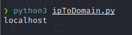
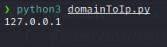

## Python3 - socket

Este post pretende ser una introducción al módulo <strong>socket</strong> de Python. Socket es un módulo estándar de Python que permite conexiones TCP/IP y UDP.
Varias familias de socket son compatibles con este módulo. En este post vamos a tratar con la familia AF_INET, que se utiliza para designar el tipo de de direcciones 
con las que el socket puede comunicarse (en este caso con direcciones de Protocolo de Internet v4, IPv4). Igualmente trataremos sobre los sockets STREAM, para el protocolo
TCP orientado a la conexión.

## Creando un Socket

Como se ha mencionado antes, para crear un socket pasaremos como parámetro la familia AF_INET (IPv4) y de tipo SOCK_STREAM (TCP).

```bash
s = socket.sockect(socket.AF_INET,socket.SOCK_STREAM)
```

## Resolviendo dominios y direcciones IPs

Con el método <strong>gethostbyaddr()</strong> podemos obtener un nombre de dominio a través de la IP.

```bash
#!/usr/bin/python3

import socket

dominio,alias,direccion = socket.gethostbyaddr("127.0.0.1")

print(dominio)
```

El método gethostbyaddr() devulve una tupla con el nombre de dominio, los aliases y las direcciones IPs. En este caso nos interesa mostrar el nombre de dominio.



Para obtener la IP de un dominio utilizamos el método <strong>gethostbyname()</strong>.

```bash
#!/usr/bin/python3

import socket

ip = socket.gethostbyname("localhost")

print(ip)
```

La salida al ejecutar el script es:



## Creando nuestra primera herramienta con Socket, portScan.py

Vamos a crear nuestra primera herramienta en Python con el módulo socket y argparse. Esta herramienta servirá para escanear los puertos abiertos de un objetivo. Recomiendo visitar el post sobre
[argparse](../pythonI-argparse) si aún no lo has visto.

```bash
#!/usr/bin/python3
import argparse,socket,sys 	# Importamos los módulos necesarios para el script

description = """ Ejemplos de uso:
		
		+ Escaneo básico, default port 80: 

			python3 portScan.py -t 192.168.136.130

		+ Indica un puerto específico:

			python3 portScan.py -t 192.168.136.130 -p 80,443,445

		+ Indica un rango de puertos a escanear:

			python3 portScan.py -t 192.168.136.130 --range 1-445 """
 
parser = argparse.ArgumentParser(description="Port scanning",epilog=description,formatter_class=argparse.RawDescriptionHelpFormatter)

parser.add_argument("-t",metavar="Host",dest="host",help="Indica el host a escanear. Obligatorio.",required="True")

parser.add_argument('-p',dest="ports",metavar="Ports",help="Indica los puertos a escanear separados por coma. Ejemplo: -p 80,8080,443. Por defecto puerto 80",default="80")

parser.add_argument('--range',metavar="Rango",help="Indica un rango de puertos a escanear separados por un guión. Ejemplo: --range 130-140")

params = parser.parse_args()

if params.range is None: #Si no se indica un rango de puertos, escanea los puertos indicados en el parámetro -p

	ports = params.ports.split(",")

	try:

		print("\n[*] Escaneando objetivo %s...\n" % params.host)

		for port in ports:			

			s = socket.socket(socket.AF_INET,socket.SOCK_STREAM) # Se crea al objeto socket

			s.settimeout(0.3) # Indica el tiempo de intento de conexion

			result = s.connect_ex((params.host,int(port)))

			if result == 0: # Si el resultado de conexión en el puerto es 0, el puerto está abierto
				
				print("[+] Puerto %s abierto\n" % port)

			else:

				print("[-] Puerto %s cerrado\n" % port)

			s.close()

	except:		
	
		print("[!]Error de conexion con %s" %params.host)

		sys.exit(1)

if params.range: # Si se indica el parámetro --range, la herramienta escaneará los puertos que están dentro del rango indicado.

	rango = params.range.split("-")

	start = int(rango[0]) # Almacena el primer valor del rango pasado por parámetro

	end = int(rango[1]) # Almacena el segundo valor del rango pasado por parámetro

	try:

		print("\n[*] Escaneando objetivo %s...\n" % params.host)

		for port in range(start,end+1):

			s = socket.socket(socket.AF_INET,socket.SOCK_STREAM)

			s.settimeout(0.3) # Establece el tiempo de intento de conexión

			result = s.connect_ex((params.host,int(port)))

			if result == 0: # Si el restultado de la conexión es 0, el puerto está abierto
			
				print("[+] Puerto %s abierto\n" % port)

			else:
				
				print("[+] Puerto %s cerrado\n" % port)				

			s.close()	
			
	except:

		print("[!]Error de conexion con el objetivo")
		sys.exit(1)
```


