## Python3 - requests

Requests es una librería de Python para hacer peticiones HTTP, ya sea para consumir una API, extraer información de una web o enviar datos de forma automatizada.
Al tratarse de una librería de terceros es necesario instalarla antes de usarla. Para ello utiliza el comando <strong>pip install requests</strong>


## Peticiones GET con requests

Importa el módulo requests y utiliza el método GET indicando la URL a la que hacer la petición.

```bash
import requests
response = requests.get("https://google.com")
```
Ahora tenemos el objeto response del que podemos extraer todo tipo de información.

### Pasar parámetros por GET

Para pasar datos en la cadena de la URL utilizamos el atributo params de la función GET en formato clave:valor
Podermos crear un diccionario con los datos a enviar y lo pasamos al atributo params.

```bash
import requests
parametros = {'key1':'val1','key2':'val2'}
response = request.get(url,params=parametros)
```

## Peticiones POST con requests

Para realizar una petición POST con el módulo requests, pasamos al atributo data de la función POST de requests los datos a enviar en formato clave:valor.

```bash
import requests
data = {'user':'usuario','password':'password'}
response = requests.post("https://mipagina/login",data=data)
```

## HTTP: PUT, DELETE, HEAD y OPTIONS

Requests también admite solicitudes HTTP de tipo PUT, DELETE, HEAD y OPTIONS

```bash
r = requests.put("https://mipagina/put",data={'key':'value'})
r = requests.delete("https://mipagina/delete")
r = requests.head("https://mipagina")
r = requests.options("https://mipagina")
```

## Contenido de la respuesta

Hasta ahora hemos realizado peticiones con la librería requests. Ahora vamos a ver el contenido de la respuesta de una petición almacenado en el objeto response a través de sus atributos.

- <strong>response.url</strong>: vemos la url solicitada

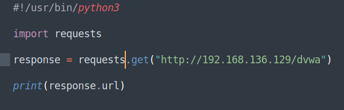

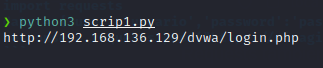

En este caso, response.url muestra una redirección a la URL http://192.168.136.129/dvwa/login.php, ya que no hemos iniciado sesión en la aplicación. De hecho,
a través del atributo <strong>history</strong> podemos ver los códigos de estado de la redirección.

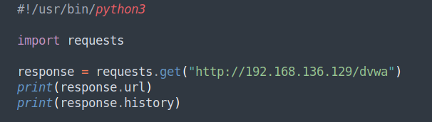

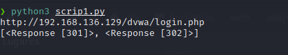

Si queremos desactivar la redirección, indicamos el parámetro <strong>allow_redirects=False</strong> en la petición.

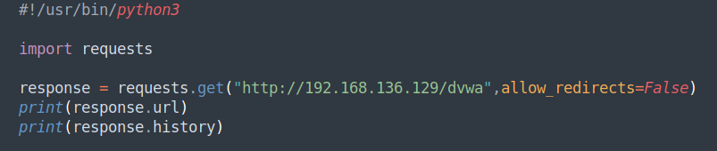

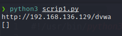

- <strong>response.status_code</strong>: para ver el código de respuesta de la petición	


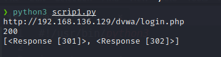

Como se puede apreciar en la imagen el código de respuesta de la petición es exitoso y se muestra el código de respuesta 200 del servidor, aunque como se ha
comentado antes, al no iniciar sesión en la aplicación, también se muestra una redirección a la página de login.php.

- <strong>response.text</strong>: para ver la respuesta en formato texto

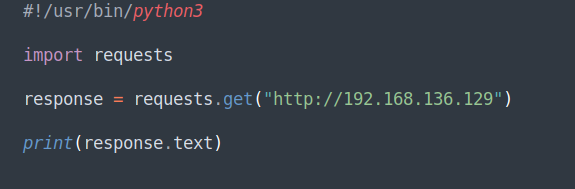

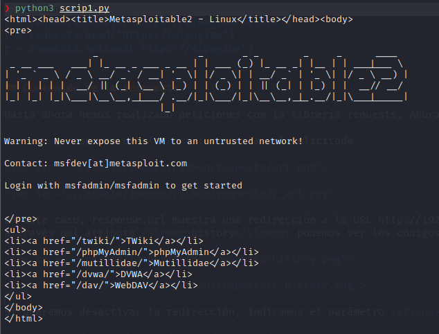

- <strong>response.headers</strong>: para ver las cabeceras de la respuesta

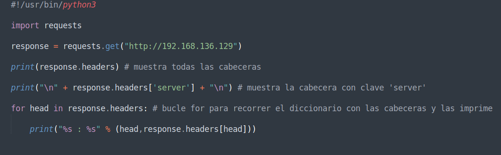

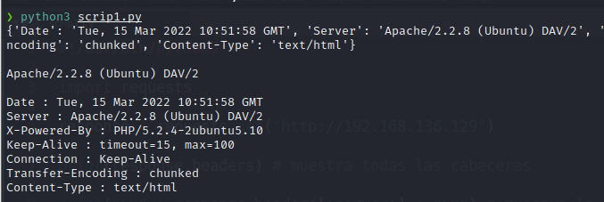

En la imagen anterior podemos ver tres formas de mostrar las cabeceras de la respuesta.

## Encabezados personalizados

La librería requests permite también crear peticiones con encabezados personalizados a través del parámetro headers de la petición.

```bash
import requests

response = requests.get("http://192.168.136.129",headers={'user-agent':'user-agent'})
```
## Timeouts

Por último vamos a ver	el parámetro timeout de una petición requests. Se puede indicar, mediante el parámetro <strong>timeout</strong>, que la solicitud deje de esperar una respuesta después
de un número determinado de segundos.
```bash
response = requests.get("url",timeout=0.02)
```

Hasta aquí una aproximación al módulo requests de Python. 
Hasta la próxima.
