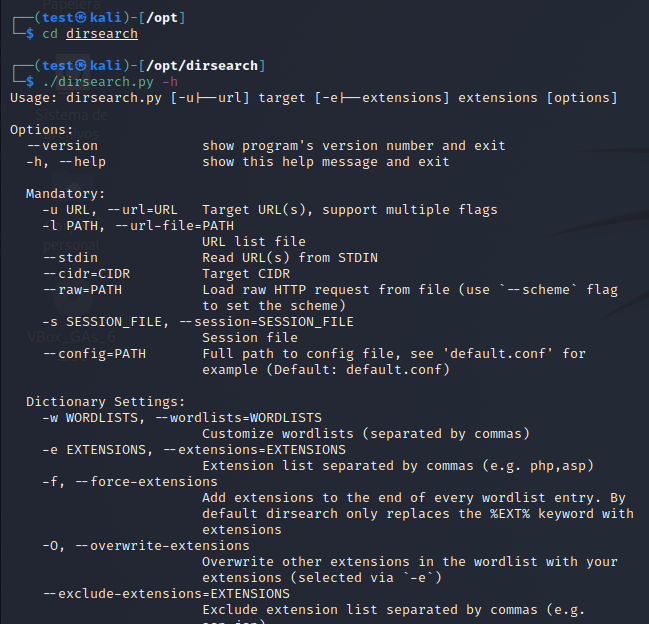
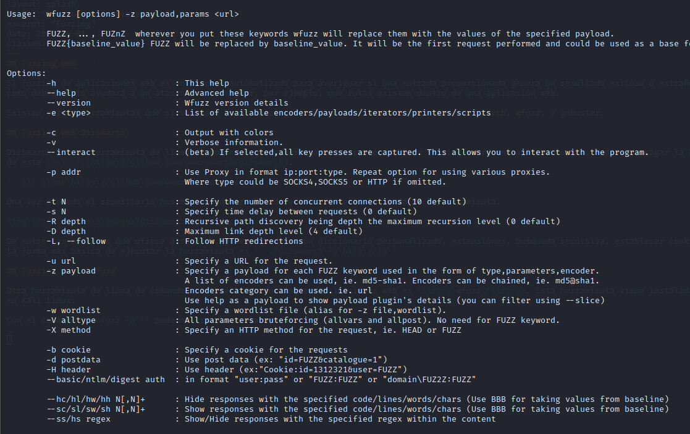
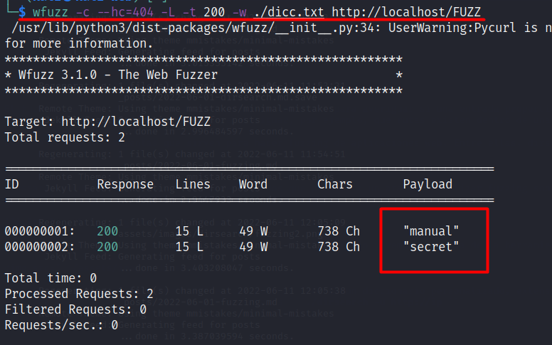
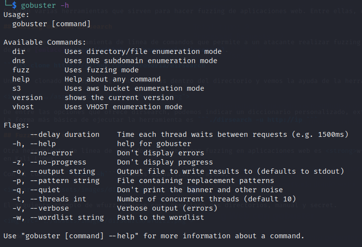
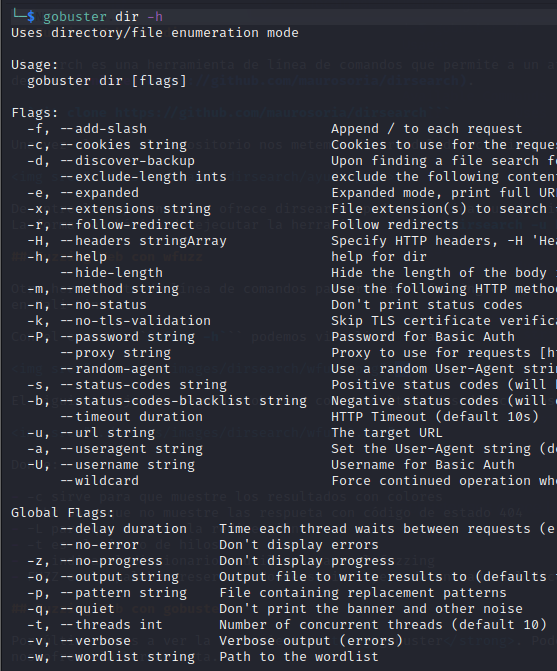
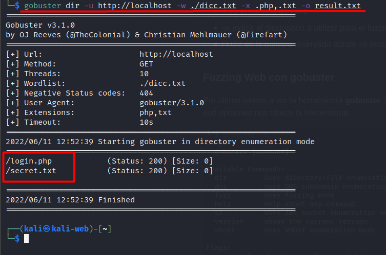

# Fuzzing Web

El fuzzing de aplicaciones web es un proceso automatizado para averiguar si una entrada proporcionada genera un resultado exitoso o extraño (la aplicación no se comporta
como debe). Esto ayudará a un atacante a averiguar, por ejemplo, que rutas existen dentro de una aplicación web.

Existen varias herramientas que sirven para hacer fuzzing de aplicaciones web. Entre ellas, dirsearch, wfuzz, y gobuster.

## Fuzzing Web con dirsearch

Dirsearch es una herramienta de línea de comandos que permite a un atacante realizar fuzzing sobre una aplicación web. Podéis descagar la herramienta clonando el repositorio de GitHub a través
de este [enlace](https://github.com/maurosoria/dirsearch).

```git clone https://github.com/maurosoria/dirsearch```

Una vez clonado el repositorio nos metemos dentro del directorio y vemos la ayuda de la herramienta.



De entre las opciones que ofrece dirsearch, podemos indicar un diccionario personalizado, extensiones, buśqueda recursiva, establecer cookies...
La forma más básica de ejecutar la herramienta es ```./dirsearch -u http://ip ```

## Fuzzing Web con wfuzz

Otra herramiente de línea de comandos para realizar fuzzing en aplicaciones web es <strong>wfuzz</strong>. Esta herramienta viene instalada por defecto
en Kali Linux.

Con el comando ```wfuzz -h``` podemos visualizar la ayuda.

  

El siguiente ejemplo de wfuzz obtiene como resultado dos directorios, manual y secret.



Donde:

- -c sirve para que muestre los resultados con colores
- --hc para que no muestre las respueta con código de estado 404
- -L para que muestre la redirección
- -t es el número de hilos
- -w indica el diccionario a utilizar para el fuzzing
- FUZZ es la palabra reservada donde se incluye cada entrada del diccioario

## Fuzzing Web con gobuster

Por último vamos a ver la herramienta <strong>gobuster</strong>. Podemos instalar gobuster con el comando ```sudo apt install gobuster```. Ejecutamos la ayuda para ver qué opciones
nos ofrece la herramienta.



Gobuster nos ofrece la posiblidad de buscar directorios y ficheros ocultos mediante la opción dir. Para ver qué opciones nos ofrece este modo podemos ejecutar su ayuda.



El siguiente comando de gobuster obtiene como resultado los ficheros login.php y secret.txt.



Donde:

- dir es la opción de gobuster para encontrar directorios y archivos
- -u para establecer el target
- -w indica el diccionario a utilizar para el fuzzing
- -x para indicar que busque archivos con las extensiones pasadas y separadas por coma
- -o para exportar los resultados en un archivo
 
En este post hemos hablado sobre diferentes herramientas para poder realizar fuzzing sobre aplicaciones web, centrándonos en la búsqueda de directorios y archivos. Existen otras herramientas
para realizar esta tarea durante la fase de enumeración. Os animo a profundizar más sobre estas herramientas, y descubrir algunas más y elegid aquella con la que os sintáis más cómod@s.

Hasta la próxima.


