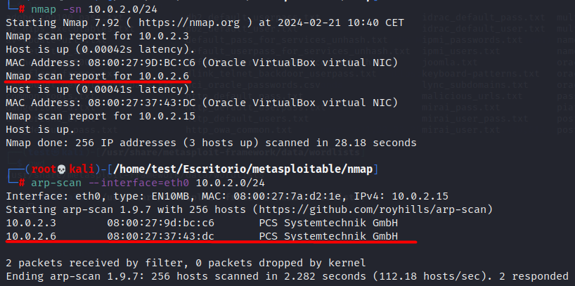
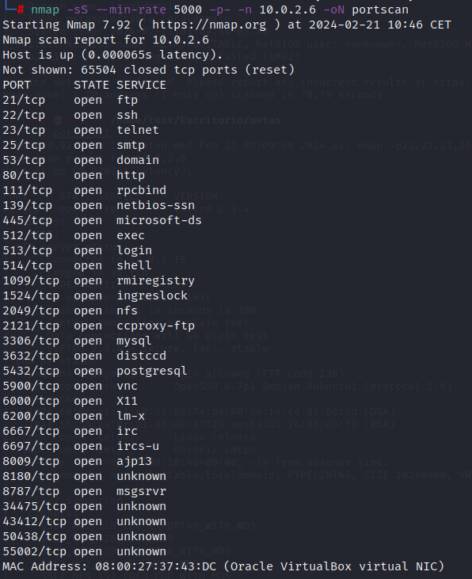
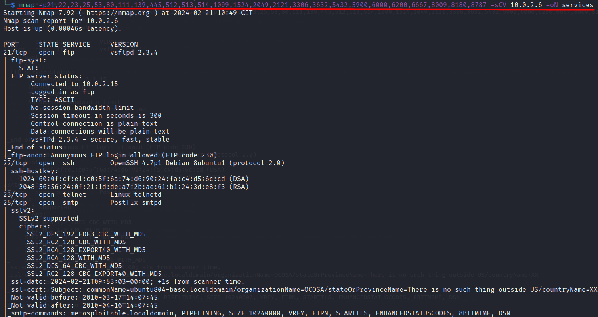
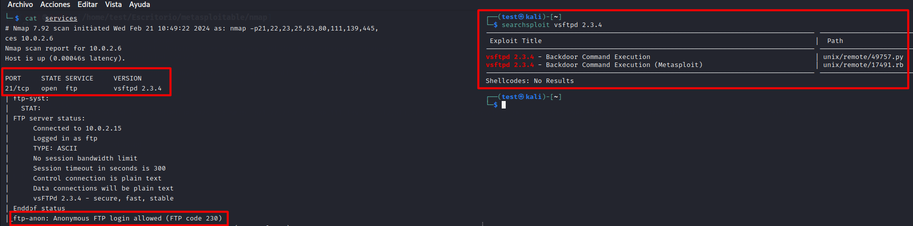
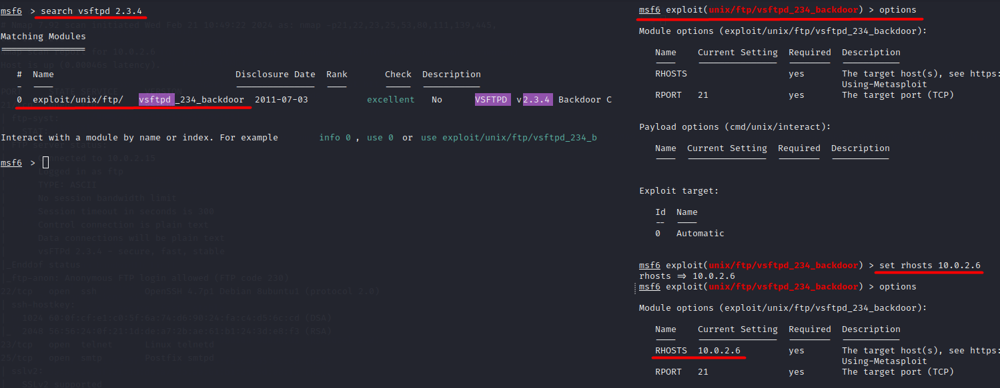
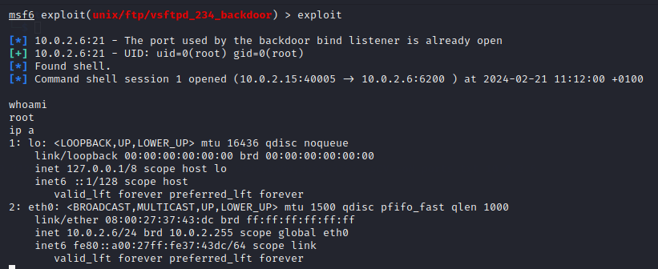

 
# Atacando el servicio FTP de Metasploitable

En esta primera entrega de <strong>Explotando Metasploitable</strong> vamos a realizar un reconocimiento inicial de la red para descubrir hosts activos. Seguidamente iniciaremos la fase de escaneo para ver
los puertos abiertos de la máquina Metasploitable, y lanzaremos nmap para descubrir los servicios y versiones que corren bajo estos puertos.
Una vez identificados los servicios, atacaremos el puerto 21 que corresponde al servicio FTP de la máquina Mestasploitable.
## Reconocimiento inicial. Enumerando hosts activos dentro de nuestra red

Lo primero que debemos hacer es enumerar hosts activos dentro de nuestra red. Para ello podemos usar varias alternativas. En este caso lo haremos con <strong>nmap</strong> y <strong>arp-scan</strong>.

Los resultados nos indican que hay un host activo con la dirección ip 10.0.2.6.

## Escaneo de puertos con nmap

Tras esta fase inicial de reconocimiento de la red vamos a lanzar un escaneo con nmap para ver que puertos tiene abiertos la máquina.

## Servicios y versiones de puertos abiertos

Con nmap podemos ver que servicios y versiones corren bajo estos puertos.

## Puerto 21 servicio FTP

Nos vamos a centrar en este caso en el puerto 21. Este puerto corre un servicio FTP, y como se puede observar en la imagen, la versión del servicio es vsftpd 2.3.4.

Esta versión del servicio FTP es vulnerable. Podemos buscar exploits para esta versión con el comando <strong>searchsploit vsftpd 2.3.4</strong>, y obtenemos como resultado 2 exploits. Usaremos Metasploit para
atacar el puerto 21.

## Usando Metasploit para atacar el servicio FTP

Una vez dentro de la consola de Metasploit, usamos el comando <strong>search vsftpd 2.3.4</strong> para buscar qué exploits corren bajo esta versión. Seteamos las opciones de configuración que requiere el exploit.

Lo ejecutamos y observamos que obtenemos una shell de la máquina vícitma como usuario root.

Hasta aquí la primera entrega de <strong>Atacando Metasploitable</strong>. Hemos enumerado la red para ver hosts activos con nmap y arp-scan, con nmap hemos visto qué puertos y servicios tiene abiertos la máquina, y hemos
visto como explotar la versión vulnerable del servicio FTP en el puerto 21.

Hasta la próxima!!

